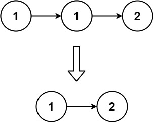

# 83 删除排序链表中的重复元素

### 题目链接

[Leetcode](https://leetcode.com/problems/remove-duplicates-from-sorted-list/) / [力扣](https://leetcode-cn.com/problems/remove-duplicates-from-sorted-list/)

83\. Remove Duplicates From Sorted List (Easy)

存在一个按升序排列的链表，给你这个链表的头节点 head ，请你删除所有重复的元素，使每个元素 `只出现一次` 。

返回同样按升序排列的结果链表。

示例1:



```
输入：head = [1,1,2]
输出：[1,2]
```

示例2:


```
输入：head = [1,1,2,3,3]
输出：[1,2,3]
```

### 算法

* 一次遍历的方法比较好想，有两种方法：一种是遇到值相等的节点保留第一个节点；另一种是遇到值相等的节点保留最后一个节点。

* 使用两个指针 pre 和 cur：pre 节点表示固定一个节点，cur 用于寻找所有跟 pre 值相等的节点。如果 cur.val 等于 pre.val，则删除 cur。如果 pre.val 不等于 cur.val 说明重复的元素都已经删除完了，因此将pre固定为当前即cur

* 移动 cur 指针

```python
def deleteDuplicates(self, head: ListNode) -> ListNode:
    if not head:
        return
    pre, cur = head, head.next
    while cur:
        if pre.val == cur.val:
            pre.next = cur.next
        else:
            pre = cur
        cur = cur.next
    return head
```