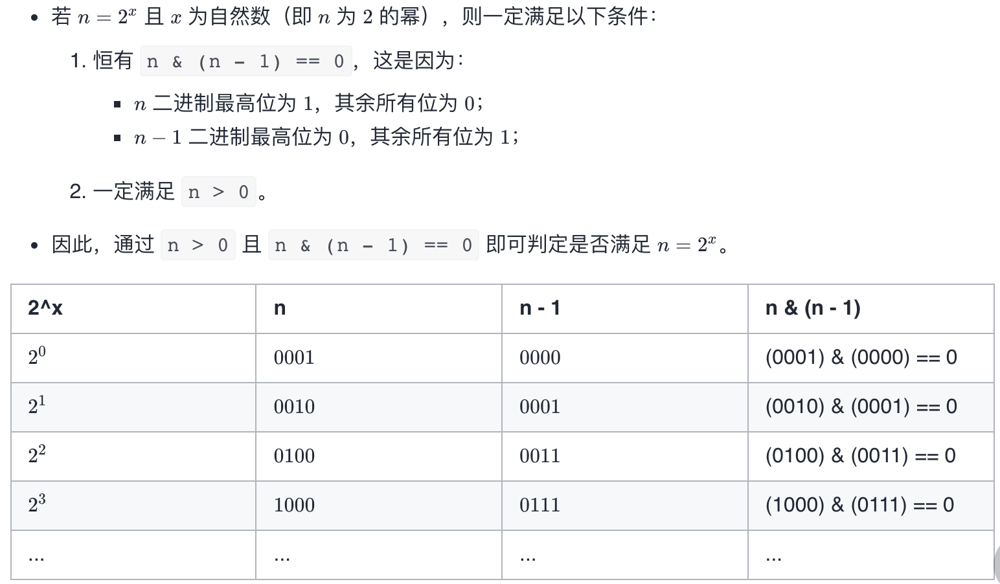
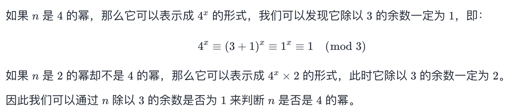

# 326 3的幂

### 题目链接

[Leetcode](https://leetcode.com/problems/2-keys-keyboard/) / [力扣](https://leetcode-cn.com/problems/2-keys-keyboard/)

650\.  Two Keys Keyboard (Medium)

给定一个整数，写一个函数来判断它是否是 3 的幂次方。如果是，返回 true ；否则，返回 false 。

整数 n 是 3 的幂次方需满足：存在整数 x 使得 n == 3<sup>x</sup> 


示例1:

```
输入：n = 27
输出：true
```

示例2:

```
输入：n = 0
输出：false
```

### 算法

我们不断地将 n 除以 3，直到 n=1。如果此过程中 n 无法被 3 整除，就说明 n 不是 3 的幂。

本题中的 n 可以为负数或 0，可以直接提前判断该情况并返回 False，也可以进行试除，因为负数或 0 也无法通过多次除以 3 得到 1。


```python
def isPowerOfThree(self, n: int) -> bool:
    while n and n % 3 == 0:
        n //= 3
    return n == 1
```

## 2的幂


```python
def isPowerOfTwo(self, n: int) -> bool:
    return n > 0 and n & (n - 1) == 0
```

## 4的幂



```python
def isPowerOfFour(self, n: int) -> bool:
    return n > 0 and (n & (n - 1)) == 0 and n % 3 == 1
```